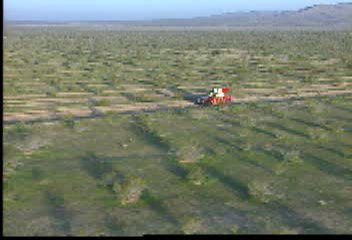
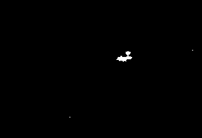
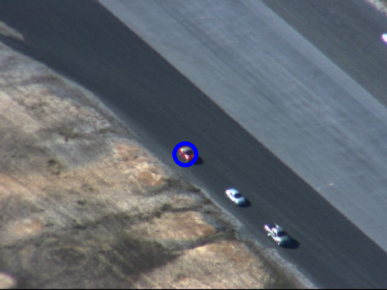
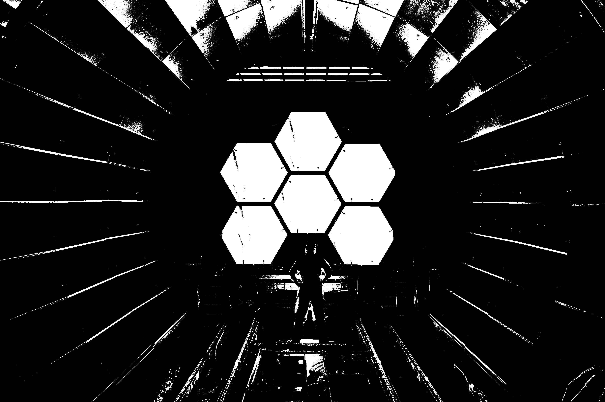
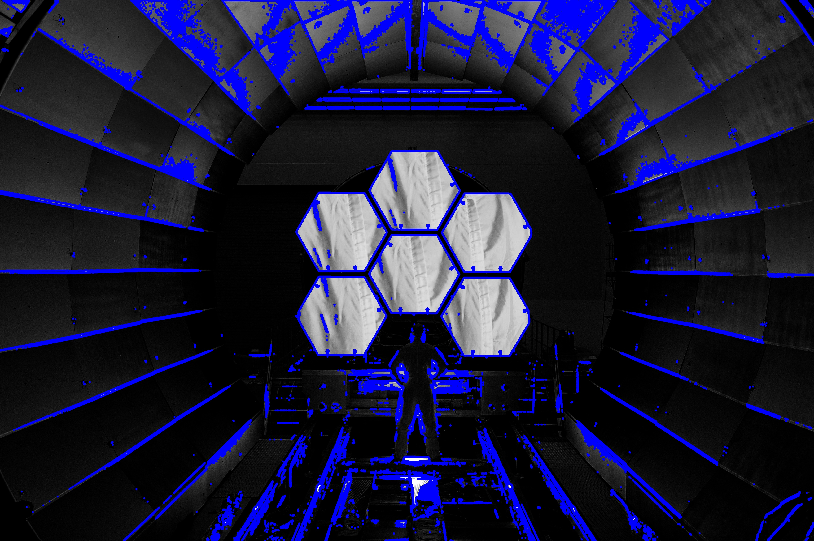
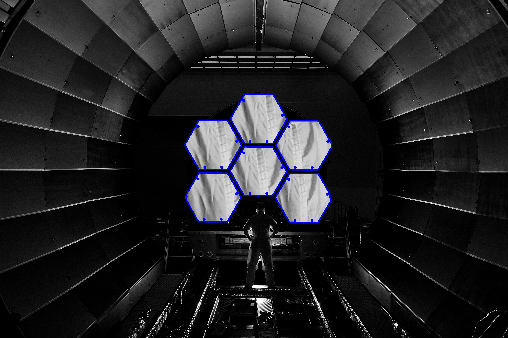

# Computer Vision

  

"Humans use their eyes and their brains to see and visually sense the world around them. Computer vision is the science that aims to give a similar, if not better, capability to a machine or computer. Computer vision is concerned with the automatic extraction, analysis and understanding of useful information from a single image or a sequence of images" - that is the definiton google will come up with. It is pretty self explanatory. As the name suggests it gives a sense of intelligence to the vision of the machine i.e the camera.

This is the python implementation of some of the common yet important techniques often used in computer vision. Various methodologies like tracking, marking, contour drawing, feature extraction etc. are explained and implemented. Source codes are available in the repository.

## Pre Requisites

1. [Thresholding](http://aishack.in/tutorials/thresholding/) 

## [Tracking](Tracking)

  

This method is used when there is a need to track any subject in a video (or a set of frames). A **marker** is drawn around the subject in each frame so as to identify it. The algorithm can be applied on both RGB and HSV colour spaces and the choice really depends upon the situation. 

**RGB** colour space is useful in case of humans. We can generate and identify any colour irrespective of the difference in intensity, texture etc. But machines are not so intelligent to do so. Light blue and dark blue are completely different colours for them. Sometimes, in the RGB colour sapce, there is a difference in the colour across the same surface due to uncontrollable factors. This makes tracking an objeect very difficult.

  

**HSV** colour space is muxh more efficient when it comes to identifying an object on the basis of its colour. Light blue and dark blue have the same 'Hue' value and hence it is easier to identify the colour in am image in HSV space. Here we present the method in both RGB and HSV colour sapces.

We have *2 datasets* in which we have to **track the red vehicle**. The datasets have not been uploaded on this repository. Please feel free to ask for it.

### RGB Space

In this method the red-green-blue colour channels of the images are used to detect the red vehicle. The code is written from scratch without using any libraries from OpenCV to detect the target. Basic steps followed are:

1. Split the image into blue, green red channels.
2. Subtract the green and blue channels from the red channel. This helps us to retain the pixels where only red colour           is present. For example the white space in the original image contains all the three components. Hence, when green+blue channel is subtracted from the red channel those areas get cancelled which later can be reduced to zero by **thresholding**.
3. Now to place the marker, get the **mean point** among the ones which are not reduced to zero. **cv2.circle** function is used to draw the circular marker. You can read more about it and other drawing functions [here](http://docs.opencv.org/2.4/modules/core/doc/drawing_functions.html)

Source code is [here](Tracking/rgb.py).

### HSV Space

This is an another method which uses hue-saturation-value space to detect the target. This code directly uses various OpenCV libraries for thresholding. Basic steps followed are:

1. Convert the colour space of the image to HSV.
2. Define a range of hue values over which the image will be thresholded. Hue value of any colour can be determined by the inbuilt function of OpenCV **cvtColour**.
3. Now to place the marker, get the **mean point** among the ones which are not reduced to zero.

Source code is [here](hsv.py).

### Results

#### Dataset 1

Original Image

  

Thresholded Image

  

Original image with the marker

  

#### Dataset 2

Original Image

  

Thresholded Image

  

Original image with the marker

  

## [Image Segmentation](Segmentation)

  

In computer vision, image segmentation is the process of partitioning a digital image into multiple segments (sets of pixels, also known as super-pixels). The goal of segmentation is to simplify and/or change the representation of an image into something that is more meaningful and easier to analyze.

We'll apply a simpler version of segmentation on the image below
The source code is [here](Segmentation/hex.py)

  

We have to detect only the hexagons. Hence we have to segment the image such that the hexagons are separated from rest of the image. Here is the walkthrough:

1. We can see that most of the part in the image is dark i.e have low pixel value except our target (hexagons) and other few places which are brighter. This gives us an advantage - segmenting the hexagons from most of the parts of the image becomes easy.
2. We use thresholding method to just keep the hexagons and other brighter parts. Thresholded image looks like this: 

  

            *Thresholding parameters were fine tuned by hit and trial to get best results*

3. Now we have to further segregate the hexagons from the remaining parts. For this we use **findContours** function of OpenCV that locates all the continuous points in the image and stores them as a list of lists. Applying the same on the thresholded image we get:

  

4. Hence we see that along with hexagons several small contours are also drawn on the image. To get rid of them, we choose only the largest 6 contours and draw them. It looks like this:

  

